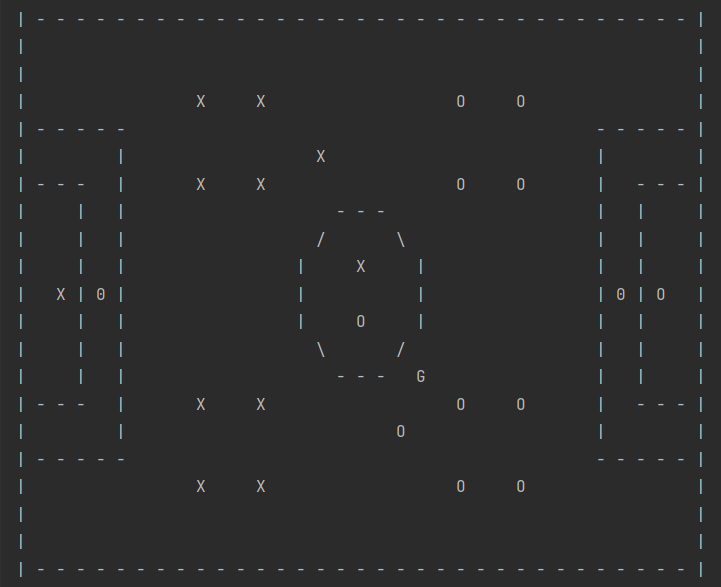

# Football-Simulation-Java-CLI

In in game a console application is used to simulate football game.

The pitch is look like below and all the movements are generated by random methods alomg with some rules.

Another method is proposed, create field for goal and make that as the evaluation matrix for the players.
That way we can use minimax algorithm to find the best move. But this is not yet impimented.

### Game Rules:

1. Game start from ball in center of the field. - Done
2. Then team which won the toss get they chance to kick. - KICK OFF -Done
     The players should be in their initial positions. (4 4 2)
3. a. First ball is considered as directly go in to the goal or not, or out of the filed. - Not Using now
4. b. Then Goto goal, or not, Out of the filed, Passed in to Player (Done) and other conditions are applied.
5. When ball go out of the field (Side lines), Change the team and let them to throw the ball from where the ball left the filed
6. When ball go out from the goal line,
     CORNER KICK - if defending team have the ball, then they can kick the ball from the Corners. (Not yet)
     GOAL KICK - if opposing team last touch the ball, goalie of defending team kick ball from the goal box. (Not yet)

7. Substitution - 3 player can be taken and replaced from the subusing players. No injury are considered.

